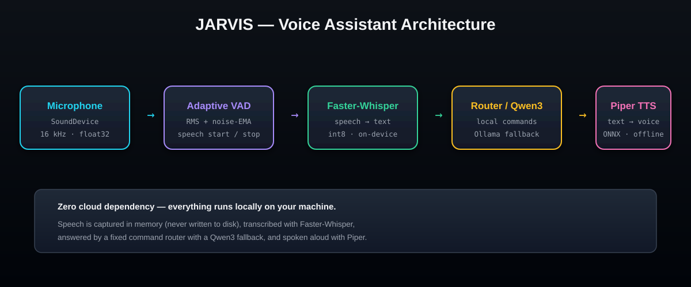
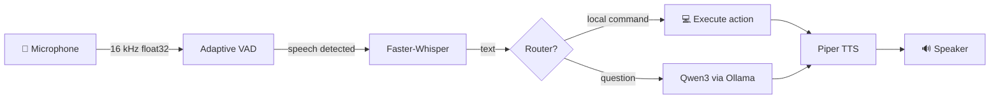

<div align="center">

# 🤖 JARVIS

### Your hands-free, fully local, voice assistant

A private voice assistant that runs **100% on your machine** — no cloud, no accounts, no audio leaving your PC.



[](https://www.python.org)
[](https://github.com/SYSTRAN/faster-whisper)
[](https://github.com/rhasspy/piper)
[](https://ollama.com)
[]()
[]()

</div>

---

## ✨ Features

| | Feature | Why it matters |
|---|---|---|
| 🎙️ | **Noise-adaptive VAD** | Auto-calibrates to your mic, so it works in noisy rooms |
| 🧠 | **Faster-Whisper STT** | Accurate speech-to-text, running in int8 on your CPU |
| 🗣️ | **Piper neural TTS** | Natural offline voice — no robotic cloud TTS |
| 💬 | **Qwen3 conversational brain** | For everything that isn't a local command |
| ⚡ | **Command router first** | Local actions (apps, time, date) respond instantly |
| 🔒 | **Zero cloud** | Your voice never leaves your machine |
| 📁 | **In-memory audio** | No temp WAV files — audio lives only in RAM |

---

## 🧬 Architecture



**The pipeline, stage by stage:**

1. **Capture** — `sounddevice` streams 16 kHz mono audio straight into memory.
2. **Voice Activity Detection** — an adaptive RMS threshold with noise-EMA tracks your ambient noise and detects speech start/stop (`audio/vad.py`).
3. **Transcription** — `Faster-Whisper` converts the utterance to text on-device (`speech/whisper.py`).
4. **Routing** — `CommandRouter` matches safe, fixed commands first for instant local actions. Anything else falls back to **Qwen3** through Ollama (`commands/router.py`, `ai/ollama.py`).
5. **Speech** — **Piper** synthesizes the reply and plays it back (`speech/tts.py`).

---

## 🛠️ Tech Stack

| Layer | Tool | Notes |
|---|---|---|
| Audio I/O | [sounddevice](https://python-sounddevice.readthedocs.io) | PortAudio bindings |
| Speech-to-text | [Faster-Whisper](https://github.com/SYSTRAN/faster-whisper) | CTranslate2 · `int8` on CPU |
| Language model | [Qwen3 8B](https://ollama.com/library/qwen3) via [Ollama](https://ollama.com) | Local, `keep_alive` 30m |
| Text-to-speech | [Piper](https://github.com/rhasspy/piper) | ONNX · `en_US-lessac-medium` |
| Utilities | NumPy · Requests | |

---

## 📦 Installation

### 1. Prerequisites
- Python **3.10+**
- [Ollama](https://ollama.com/download) (for conversational answers)

### 2. Setup

```bash
# Clone the repo
git clone https://github.com/bezawadamahidhar20-droid/JARVIS.git
cd JARVIS

# Create a virtual environment
python -m venv .venv
.venv\Scripts\activate

# Install dependencies
pip install sounddevice numpy faster-whisper piper-tts requests

# Pull the LLM into Ollama
ollama pull qwen3:8b

# Download the Piper voice (one-time)
python -m piper.download_voices en_US-lessac-medium
```

> 💡 Place the downloaded voice as `voices/en_US-lessac-medium.onnx` (see `config.py`).

---

## 🚀 Usage

```bash
python main.py
```

```
============================
       JARVIS ONLINE
============================
[+] Command router ready
[*] JARVIS is listening...

Listening...
[USER] what time is it
[JARVIS] The time is 10:42 PM.
```

**Say:** `"hey, what time is it"`, `"open Chrome"`, `"what is the capital of France?"` — or simply **`"goodbye"`** to shut down.

---

## 🗺️ Supported Commands

| You say | What happens |
|---|---|
| "what time is it" | Speaks the current time |
| "what's today's date" | Speaks the date |
| "open notepad" / "open chrome" | Launches the app |
| "open file explorer" / "open explorer" | Opens Explorer |
| "open command prompt" / "open cmd" | Opens a terminal |
| "open calculator" | Opens Calculator |
| "goodbye" / "exit" | Shuts down JARVIS |
| *anything else* | Answered by Qwen3 |

---

## ⚙️ Configuration

Everything lives in [`config.py`](config.py):

```python
# ---- Audio capture ----
SAMPLE_RATE = 16000
INPUT_DEVICE = None            # None = system default mic

# ---- Whisper ----
WHISPER_MODEL = "base"         # e.g. "tiny.en", "base", "small"
WHISPER_COMPUTE_TYPE = "int8"

# ---- Ollama ----
OLLAMA_MODEL = "qwen3:8b"
OLLAMA_NUM_PREDICT = 120       # short, voice-friendly replies

# ---- JARVIS personality ----
SYSTEM_PROMPT = "You are JARVIS, a concise and helpful desktop voice assistant..."
```

Tune the VAD in `audio/vad.py` and mic capture in `audio/microphone.py` for your room.

---

## 📁 Project Layout

```
jarvis/
├── main.py                # Main loop: capture → STT → route → TTS
├── config.py              # All tunable settings
├── ai/
│   └── ollama.py          # Qwen3 client (Ollama /api/generate)
├── audio/
│   ├── microphone.py      # Streaming capture + speech segmentation
│   └── vad.py             # Adaptive voice activity detection
├── commands/
│   └── router.py          # Fixed safe command mappings
├── speech/
│   ├── whisper.py         # Faster-Whisper wrapper
│   └── tts.py             # Piper TTS wrapper
├── utils/
│   └── logger.py          # Logging + timing helpers
├── voices/                # Piper ONNX voices
└── docs/
    └── architecture.svg   # This diagram
```

---

## 🧪 Testing

The repo ships with standalone benchmarks so you can verify each stage:

```bash
python test_whisper_benchmark.py   # STT latency on your CPU
python test_benchmark.py           # end-to-end timing
python test_microphone.py          # mic capture sanity check
python test_ollama.py              # Ollama / Qwen3 connectivity
```

> ⚠️ JARVIS is tuned for **Windows**. The command router launches Windows apps (Chrome, Explorer, cmd, calc).

---

## 📜 License

Distributed under the **MIT License**. See `LICENSE` for details.

---

<div align="center">

**Made with ⚡ on Earth, running 100% offline.**

</div>