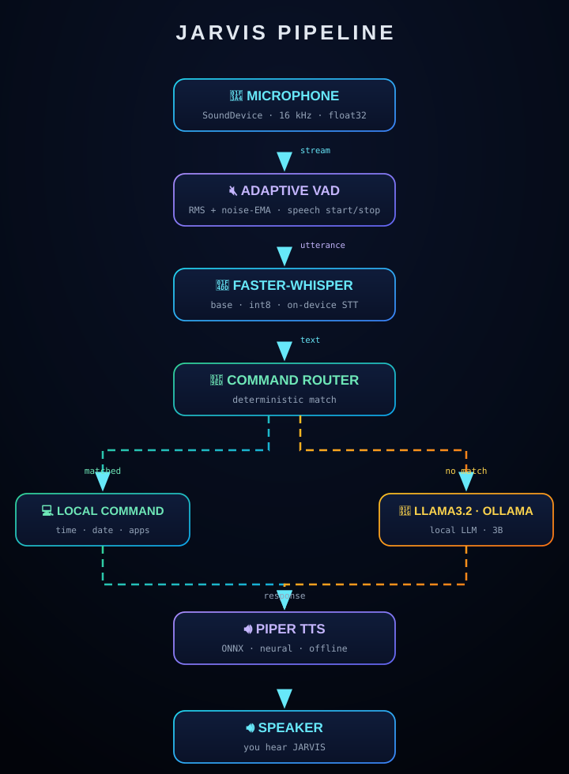
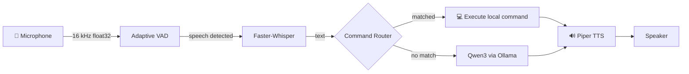
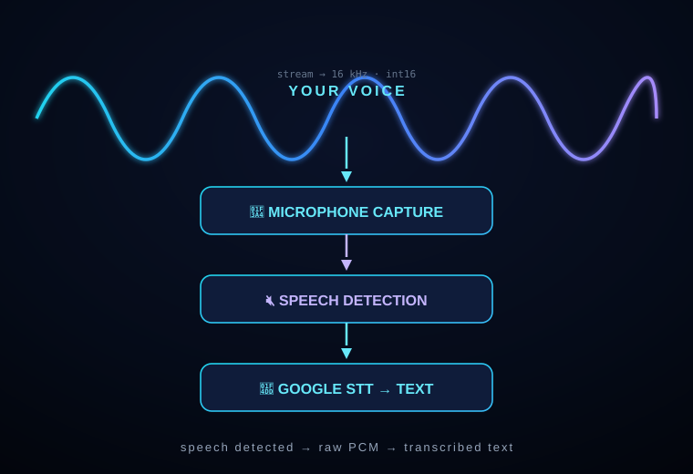

<div align="center">

<br/>



<br/>

**JARVIS** is a private, hands-free AI voice assistant for **Windows** — powered entirely by local speech recognition, local LLM inference, deterministic commands, and neural TTS.

**No cloud. No accounts. No audio ever leaves your PC.**

<br/>

[](https://www.python.org)
[](https://github.com/SYSTRAN/faster-whisper)
[](https://github.com/rhasspy/piper)
[](https://ollama.com)
[]()
[]()
[](LICENSE)

</div>

---

## ⚡ Project Status

**Active personal project.** The end-to-end pipeline — *mic → VAD → STT → router/LLM → TTS* — is working and tuned on the author's Windows machine. This is a hobby-grade assistant: no releases, no version guarantees, no stable public API. Expect it to perform best in the environment it was tuned for.

---

## ✨ Features

| | Capability | Why it matters |
|---|---|---|
| 🎤 | **Adaptive VAD capture** | Auto-calibrates to your mic's ambient noise and records *only* the utterance — no fixed-duration recording, no ENTER key |
| 🧠 | **Faster-Whisper STT** | On-device speech-to-text (`base`, `int8`, CPU) |
| 🧭 | **Deterministic command router** | Fixed, safe local commands (apps, time, date) execute instantly and predictably |
| 🤖 | **Qwen3 conversational brain** | Anything the router doesn't match is answered by Qwen3 through local Ollama |
| 🔊 | **Piper neural TTS** | Natural offline text-to-speech (ONNX, no cloud TTS) |
| 🔒 | **100% local / offline** | All inference happens on your machine; audio is processed in memory |
| ⚡ | **In-memory audio** | No temp WAV files in the production path — audio lives only in RAM |
| 📊 | **Pipeline timing** | Every stage (capture, STT, routing, LLM, TTS) is timed and reported per turn |
| 🖥️ | **Live terminal dashboard** | Persistent real-time HUD: audio level, stage timings, session stats, live state |

---

## 🧬 Architecture



For a GitHub-native rendering, the same pipeline in Mermaid:



**The pipeline, stage by stage:**

1. **Capture** — `sounddevice` streams 16 kHz mono `float32` audio straight into memory (`audio/microphone.py`).
2. **Voice Activity Detection** — an adaptive RMS threshold with noise-EMA tracks ambient noise and detects speech start/stop (`audio/vad.py`).
3. **Transcription** — Faster-Whisper converts the utterance to text on-device (`speech/whisper.py`).
4. **Routing** — `CommandRouter` matches fixed, safe commands first for instant local actions. Anything unmatched falls back to **Qwen3** through Ollama (`commands/router.py`, `ai/ollama.py`).
5. **Speech** — Piper synthesizes the reply and plays it back (`speech/tts.py`).

### Why this architecture?

**Deterministic commands run *before* the LLM.** Local actions (opening apps, telling time/date) are frequent, fast, and must behave identically every time. An LLM is neither fast enough nor reliable enough for that. The router gives instant, predictable OS commands; the LLM is reserved for open-ended questions where flexibility is the point.

**Qwen3 never executes system commands.** The LLM only produces *spoken text*. Every OS-level action comes from a fixed mapping in the router — never from model output (see [Security](#-security)).

---

## 🎙️ How JARVIS Hears You



### 🔇 1. Voice Activity Detection

`audio/vad.py` implements an **adaptive energy-based VAD**:

- The first ~500 ms of frames build an initial noise estimate.
- A frame is "speech" when its RMS exceeds `max(initial_threshold, noise_estimate × 3.0)`.
- The noise estimate updates only during non-speech frames, so background-level changes don't require retuning.
- Recording arms after ~250 ms of consistent speech and stops after ~900 ms of silence, or at the 15 s hard cap.

### 📝 2. Speech Recognition

`speech/whisper.py` loads a **Faster-Whisper `base` model once** (per `config.py`) and transcribes the in-memory float32 buffer with:

- `device="cpu"`, `compute_type="int8"`
- `language="en"`, `beam_size=1`
- `vad_filter=True`, `condition_on_previous_text=False`

The model downloads automatically on first run (a one-time network fetch during setup; inference is fully offline afterwards).

---

## 🧠 The Brain

```
      USER QUESTION
           │
           ▼
   ┌── COMMAND ROUTER ──┐
   │                     │
   ▼                     ▼
LOCAL COMMAND         QWEN3
   │                     │
   └─────────┬───────────┘
             ▼
         RESPONSE
```

| Route | Mechanism | Behavior |
|---|---|---|
| **Deterministic command** | Fixed pattern matching in `commands/router.py` | Instant, repeatable, safe — opens apps, speaks time/date |
| **Conversational AI** | Qwen3 8B via Ollama (`ai/ollama.py`) | Open-ended answers, spoken aloud by TTS |

**Why this is safer:** local OS actions never pass through natural language. The LLM's output is *text only* — it cannot launch processes or run shell commands. Only pre-approved mappings in the router ever execute (see [Security](#-security)).

---

## 🔊 Giving JARVIS a Voice

`speech/tts.py` uses **Piper** (`voices/en_US-lessac-medium.onnx`) to synthesize replies **in memory** and play them through `sounddevice`.

```
    TEXT
     │
     ▼
   PIPER  ──►  NEURAL AUDIO  ──►  SPEAKER
```

- ONNX neural voice, fully offline.
- No temp WAV files — audio synthesized and played from RAM.
- TTS failures are logged, never fatal.

---

## ⚙️ How It Works (a single turn)

In `main.py`, one spoken turn flows through:

1. **Listen** — `SpeechRecorder` opens a stream and waits for speech, auto-starting on the first speech frames and auto-stopping after trailing silence (or a 15-second cap).
2. **Transcribe** — the captured float32 buffer is transcribed in-memory by Faster-Whisper.
3. **Filter** — transcriptions shorter than 2 characters or with fewer than 2 alphabetic characters are treated as noise and ignored.
4. **Exit check** — if the whole utterance is an exit phrase (`exit`, `quit`, `goodbye`, `stop`, ...), JARVIS says *"Goodbye."* and shuts down.
5. **Route** — the text is checked against the deterministic command router.
6. **Act / Answer** — a matched command executes locally; otherwise Qwen3 (through Ollama) generates a concise spoken reply.
7. **Speak** — Piper synthesizes and plays the response. Each stage's latency is logged.

> If Ollama is down or the model is missing at startup, JARVIS still runs — it logs a warning and local commands keep working; only conversational questions are unavailable.

---

## 🛠️ Technology Stack

| Layer | Tool | Notes |
|---|---|---|
| 🎤 **Audio I/O** | [sounddevice](https://python-sounddevice.readthedocs.io) | PortAudio bindings |
| 🔇 **Voice activity** | Custom `AdaptiveVAD` | RMS threshold + noise EMA |
| 📝 **Speech-to-text** | [Faster-Whisper](https://github.com/SYSTRAN/faster-whisper) | CTranslate2 · `base` · `int8` on CPU |
| 🧠 **Language model** | [Qwen3 8B](https://ollama.com/library/qwen3) via [Ollama](https://ollama.com) | Local, `keep_alive` 30 min |
| 🔊 **Text-to-speech** | [Piper](https://github.com/rhasspy/piper) | ONNX · `en_US-lessac-medium` |
| 🧭 **Commands** | Python deterministic router | Fixed, safe mappings |
| 🧰 **Utilities** | [NumPy](https://numpy.org) · [Requests](https://requests.readthedocs.io) | |

---

## 📦 Requirements

| Requirement | Notes |
|---|---|
| **OS** | Windows (the command router launches Windows apps; paths assume Windows) |
| **Python** | 3.10+ recommended |
| **Git** | To clone the repository |
| **[Ollama](https://ollama.com/download)** | Runs Qwen3 locally; only needed for conversational answers |
| **Microphone + speakers** | Any input/output device PortAudio can see |

The repository does **not** ship a `requirements.txt`. Dependencies are installed directly (see below). The following packages are used by the code:

| Package | Used by |
|---|---|
| `sounddevice` | Audio capture & playback |
| `numpy` | Audio buffers / math |
| `faster-whisper` | Speech-to-text |
| `piper-tts` | Text-to-speech |
| `requests` | Ollama HTTP client |
| `scipy` | WAV-based test/diagnostic scripts only |
| `ollama` (Python SDK) | `test_qwen.py` only |

---

## 🚀 Installation

Open **PowerShell** and run each block from top to bottom.

### 1. Clone the repository

```powershell
git clone https://github.com/bezawadamahidhar20-droid/JARVIS.git
cd JARVIS
```

### 2. Create and activate a virtual environment

```powershell
python -m venv .venv
.\.venv\Scripts\Activate.ps1
```

> If PowerShell blocks the activation script, run `Set-ExecutionPolicy -Scope Process -ExecutionPolicy Bypass` first.

### 3. Install dependencies

```powershell
pip install sounddevice numpy faster-whisper piper-tts requests scipy
```

### 4. Pull the Qwen3 model into Ollama

```powershell
ollama pull qwen3:8b
```

### 5. Download the Piper voice (one-time)

```powershell
python -m piper.download_voices en_US-lessac-medium
```

Then make sure the files are available at `voices\en_US-lessac-medium.onnx` (plus its `.json`) — the default path in `config.py`. The `voices/` directory is git-ignored, so a fresh clone won't include the voice files.

### 6. Verify the microphone

```powershell
python test_microphone_level.py
```

Speak normally for 5 seconds. You should see `✅ Microphone is receiving sound.` If not, see [Troubleshooting](#-troubleshooting).

### 7. Run JARVIS

```powershell
python main.py
```

---

## ⚙️ Configuration

Everything lives in [`config.py`](config.py):

| Setting | Default | Purpose |
|---|---|---|
| `SAMPLE_RATE` | `16000` | Capture sample rate (Hz) |
| `INPUT_DEVICE` | `None` | `None` = system default mic; or a device index/name |
| `INITIAL_RMS_THRESHOLD` | `0.012` | Floor below which nothing is ever speech |
| `NOISE_MULTIPLIER` | `3.0` | Speech = noise × this |
| `NOISE_EMA_ALPHA` | `0.15` | Noise-estimate smoothing |
| `MIN_SPEECH_MS` / `SILENCE_MS` | `250` / `900` | Speech arm / stop timing |
| `MAX_RECORD_MS` | `15000` | Hard cap per utterance |
| `WHISPER_MODEL` | `"base"` | Try `"tiny.en"` vs `"base"` in the benchmark |
| `WHISPER_COMPUTE_TYPE` | `"int8"` | CPU quantization |
| `OLLAMA_MODEL` | `"qwen3:8b"` | Local LLM |
| `OLLAMA_NUM_PREDICT` | `120` | Short, voice-friendly replies |
| `OLLAMA_KEEP_ALIVE` | `"30m"` | Keep model resident between turns |
| `TTS_VOICE_PATH` | `"voices/en_US-lessac-medium.onnx"` | Piper voice |
| `SYSTEM_PROMPT` | *(JARVIS personality)* | Instructs concise spoken answers |
| `DEBUG` | `False` | Show diagnostics on the dashboard (or `JARVIS_DEBUG=1`) |

Tune capture/VAD in `audio/vad.py` and `audio/microphone.py` for your room and mic.

---

## 🚀 First Run

```powershell
python main.py
```

You should see a **live terminal dashboard** (a single persistent screen, not printed lines):

```
┌─ JARVIS ────────────────────────────────────────────────┐
│        _____    ____ _    ___________                   │
│       / /   |  / __ \ |  / /  _/ ___/                   │
│  __  / / /| | / /_/ / | / // / \__ \                    │
│ / /_/ / ___ |/ _, _/| |/ // / ___/ /                    │
│ \____/_/  |_/_/ |_| |___/___//____/                     │
│   LOCAL  •  AI  VOICE  ASSISTANT  »  LISTENING          │
└─────────────────────────────────────────────────────────┘
┌─ SYSTEM ──────────────┐┌──── JARVIS CONSOLE ────────────┐
│ ✓ Microphone  …       ││ » YOU                          │
│ ✓ Whisper     base    ││   what is python               │
│ ✓ Router      —       ││ ✓ AI  qwen3:8b                 │
│ ✓ Ollama      qwen3:8b││ » JARVIS                       │
│ ✓ TTS         —       ││   Python is a high-level...    │
└───────────────────────┘└────────────────────────────────┘
┌─ SESSION ────┐┌─ PERFORMANCE ──┐
│ Requests  2  ││ CAPTURE 1.84s  │
│ Commands  0  ││ WHISPER 1.12s  │
│ Questions  2 ││ AI      6.50s  │
│ Avg latency 11.8s││ TTS    2.30s │
│ Session    48s ││ TOTAL 11.76s │
└──────────────┘└───────────────┘
┌─────────────────────────────────────────────────────────┐
│ ●  LISTENING  •  Speak naturally…                       │
│ AUDIO  ████████░░░░░░░░░░░░░░  0.0420                   │
└─────────────────────────────────────────────────────────┘
```

The left panels show real-time component status, session stats, and per-stage
timings; the footer shows the live state with an animated spinner and a real
audio-level bar (actual mic RMS). In legacy consoles (cp1252, no Unicode) the
UI automatically falls back to plain ASCII box-drawing and symbols.

Then speak. Say *"what time is it"*, *"open Chrome"*, *"what is the capital of France?"* — or simply *"goodbye"* to shut down.

---

## 🗺️ Supported Commands

Anything the router doesn't match is sent to **Qwen3** for a conversational answer.

| Voice command | Action |
|---|---|
| "what time is it" / "what's the time" | Speaks the current local time |
| "what's today's date" / "what day is it" | Speaks the current date |
| "open notepad" | Opens Notepad |
| "open chrome" | Opens Chrome (found in standard install paths) |
| "open file explorer" / "open explorer" | Opens File Explorer |
| "open command prompt" / "open cmd" | Opens a terminal |
| "open calculator" | Opens Calculator |
| "goodbye" / "exit" / "quit" / "stop" | Exits JARVIS |
| *anything else* | Answered by Qwen3 |

> Chrome is located via `LOCALAPPDATA` and the standard `Program Files` paths. If it isn't found, JARVIS reports that it couldn't complete the command.

---

## 💬 Conversational Examples

Questions are answered by Qwen3 locally. Output is illustrative — the exact wording varies.

```
[USER]   What is Python?
[JARVIS] Python is a high-level, general-purpose programming language widely used
         for web development, data science, and automation.

[USER]   Explain recursion in simple words.
[JARVIS] Recursion is when a function calls itself to solve a smaller version of
         the same problem, until it reaches a base case.

[USER]   What is the capital of France?
[JARVIS] The capital of France is Paris.
```

---

## ⏱️ Performance

JARVIS measures and logs **pipeline latency** for every turn using `utils/logger.py`. Each label represents one stage:

| Label | Measured span |
|---|---|
| `[CAPTURE]` | Microphone stream open → utterance captured (VAD arming, speaking, trailing silence) |
| `[WHISPER]` | Faster-Whisper transcription of the captured buffer |
| `[ROUTER]` | Deterministic command matching |
| `[OLLAMA]` | Qwen3 generation via Ollama *(only when the router doesn't match)* |
| `[TTS]` | Piper synthesis + audio playback |
| `[TOTAL]` | Whole turn, from "Listening..." to after the reply is spoken |

### Collect your own numbers

The repository ships benchmarks that time each stage on **your** hardware:

```powershell
python test_whisper_benchmark.py   # tiny.en vs base on fresh mic captures
python test_benchmark.py           # tiny.en vs base on a WAV file
python test_ollama.py              # one Qwen3 generation, timed
```

### Honest expectations

- **Local CPU inference is slower than cloud APIs.** Whisper and Qwen3 both run on your CPU unless you configure GPU acceleration in Ollama / CTranslate2.
- **Model warm-up matters.** The first request after a cold start is noticeably slower while the model loads into memory. `keep_alive: 30m` keeps Qwen3 resident between turns to avoid reloads.
- **Hardware dominates.** Whisper and Ollama latency scale directly with your CPU/RAM. A weak CPU will make STT and LLM turns take several seconds.
- No benchmark results are stored in the repository — measure on your own machine.

---

## 🧪 Testing

The repository ships standalone scripts (not a pytest suite) for verifying each stage. Some require a live microphone and interaction; others are offline.

### Microphone / capture (interactive, require a mic)

| Test | Purpose | Command |
|---|---|---|
| `test_microphone.py` | Records 5 s and saves `test_audio.wav` | `python test_microphone.py` |
| `test_microphone_level.py` | Reports mic peak/RMS and passes/fails the input level | `python test_microphone_level.py` |
| `test_capture.py` | VAD auto start/stop capture, saves `captured_test.wav` | `python test_capture.py` |
| `test_capture_quality.py` | One fresh sentence → stats → energy timeline → tiny.en vs base | `python test_capture_quality.py "Open Notepad."` |
| `test_diagnostic_capture.py` | Full capture diagnostic: stats, timeline, playback, both models | `python test_diagnostic_capture.py [device_index]` |
| `test_channel_analysis.py` | Per-channel mic analysis (channel 0 drives VAD) | `python test_channel_analysis.py` |
| `test_whisper_benchmark.py` | Live mic benchmark: tiny.en vs base on the same captures | `python test_whisper_benchmark.py` |

### Whisper (offline, needs a WAV file)

| Test | Purpose | Command |
|---|---|---|
| `test_whisper.py` | Transcribes `test_audio.wav` with the `base` model | `python test_whisper.py` |
| `test_benchmark.py` | Times tiny.en vs base on a WAV file | `python test_benchmark.py [file.wav]` |

### Router (offline, no execution)

| Test | Purpose | Command |
|---|---|---|
| `test_router.py` | Shows routing decisions without executing; add `--exec` to actually launch apps | `python test_router.py` |

### LLM (requires Ollama + the Qwen3 model)

| Test | Purpose | Command |
|---|---|---|
| `test_ollama.py` | Checks Ollama availability + runs one timed generation | `python test_ollama.py` |
| `test_qwen.py` | Minimal Qwen3 query using the `ollama` Python SDK | `python test_qwen.py` |

### TTS (requires the Piper voice + speakers)

| Test | Purpose | Command |
|---|---|---|
| `test_tts.py` | Speaks a test sentence | `python test_tts.py` |

> `test_whisper.py` needs `test_audio.wav`, which `test_microphone.py` produces. `test_qwen.py` additionally needs the `ollama` Python package.

---

## 🛠️ Troubleshooting

### Microphone not detected

Run `python test_microphone_level.py` and `python test_diagnostic_capture.py`. If no input is found, check Windows **Settings → System → Sound → Input**, confirm the right default device, and verify the mic is not muted. You can select a specific device by setting `INPUT_DEVICE` in `config.py`.

### No speech detected

- Confirm the mic is receiving sound (`test_microphone_level.py` shows `✅`).
- The utterance may be below the VAD threshold — check `INITIAL_RMS_THRESHOLD` and `NOISE_MULTIPLIER` in `config.py`, or that you're not in a very noisy room.
- Watch the energy timeline from `test_capture_quality.py` / `test_diagnostic_capture.py` to see whether speech is being captured at all.

### Whisper transcription is inaccurate

- Run `test_whisper_benchmark.py` or `test_capture_quality.py` to compare `tiny.en` vs `base` on the *same* captured audio.
- Switch `WHISPER_MODEL` in `config.py` to `"base"` (default) or try `"small"` if your CPU can afford it.
- Check for clipping or very quiet input (see capture stats) — microphone gain matters.

### Ollama is slow

This is expected on CPU. First-request latency includes model warm-up; `keep_alive: 30m` keeps it loaded between turns. Consider GPU acceleration in Ollama if available.

### Qwen3 unavailable

Confirm Ollama is running and the model is installed:

```powershell
ollama list
ollama pull qwen3:8b
```

Run `python test_ollama.py` for a clear error. JARVIS still runs without Ollama — only conversational answers are disabled.

### Piper not speaking

Check that `voices\en_US-lessac-medium.onnx` and its `.json` exist (the folder is git-ignored):

```powershell
python -m piper.download_voices en_US-lessac-medium
python test_tts.py
```

Confirm your speakers/audio output device are working and not muted.

### Speaker audio entering the microphone

If JARVIS hears its own voice, enable **Windows microphone echo cancellation / noise suppression** (Settings → System → Sound → Microphone) and consider headset use. JARVIS has no echo cancellation of its own yet (see [Roadmap](#-roadmap)).

---

## 📁 Project Structure

```
JARVIS/
├── main.py                  # Main loop: capture → STT → route/LLM → TTS
├── config.py                # All tunable settings (audio, VAD, Whisper, Ollama, TTS)
├── jarvis_voice.py          # Legacy prototype (fixed-duration recording, WAV files)
├── ai/
│   ├── __init__.py
│   └── ollama.py            # Qwen3 client (Ollama /api/generate)
├── audio/
│   ├── __init__.py
│   ├── microphone.py        # Streaming capture + speech segmentation (in-memory)
│   └── vad.py               # Adaptive voice activity detection
├── commands/
│   ├── __init__.py
│   └── router.py            # Fixed, safe command mappings
├── speech/
│   ├── __init__.py
│   ├── whisper.py           # Faster-Whisper wrapper
│   └── tts.py               # Piper TTS wrapper
├── utils/
│   ├── __init__.py
│   ├── dataset.py            # Real-conversation logger (ShareGPT JSONL for fine-tuning)
│   ├── logger.py            # Logging + per-stage timing helpers (sink-able for the UI)
│   └── terminal_ui.py        # Rich live terminal dashboard (presentation layer)
├── tools/
│   ├── prepare_dataset.py    # Dedupe/filter raw logs → training JSON
│   └── finetune_qwen3.ipynb  # Colab notebook: Unsloth QLoRA fine-tune → GGUF → Ollama
├── voices/                  # Piper ONNX voice files (git-ignored)
├── docs/
│   ├── hero-core.svg        # Animated AI core (hero)
│   ├── architecture-animated.svg  # Animated pipeline diagram
│   ├── voice-pipeline.svg   # Waveform illustration
│   └── architecture.svg     # Static architecture diagram
├── test_*.py                # Microphone / STT / router / LLM / TTS diagnostics
├── LICENSE                  # MIT License
└── README.md
```

Key entry points: `main.py` runs the assistant; `config.py` is the single place to tune behavior.

---

## 🏗️ Design Decisions

### Faster-Whisper (speech-to-text)
Local CPU transcription that runs entirely on-device. `int8` quantization keeps latency acceptable on CPU with minimal accuracy loss versus `base` — fast enough for interactive voice, accurate enough for commands and questions.

### Piper (text-to-speech)
An offline neural voice shipped as a small ONNX model. Synthesizes in-memory float audio with no cloud round-trip and no temp files, so the whole loop stays local and private.

### Ollama + Qwen3 (conversation)
A locally served 8B model gives real conversational ability without external accounts. `keep_alive` keeps it resident between turns; a hard token cap keeps replies short enough to speak aloud.

### Deterministic command router
Local OS actions are too safety- and latency-sensitive to leave to an LLM. Fixed pattern matching gives instant, repeatable behavior and a hard security boundary: **only pre-approved actions ever execute** (see [Security](#-security)).

### Live terminal dashboard
The UI is a strict presentation layer in `utils/terminal_ui.py`. It never captures, transcribes, routes, or speaks — `main.py` drives it by pushing state, messages, and timing metrics, and the dashboard re-renders on a background refresh thread. Real mic RMS feeds the audio-level bar; per-stage timings come from the actual pipeline. If the console can't print Unicode, it falls back to ASCII automatically.

### Adaptive VAD
Fixed-duration recording is wasteful and sloppy. An RMS threshold that tracks ambient noise, combined with a ring buffer of pre-speech frames, records exactly the utterance — start to end — without cutting words off.

---

## 🔒 Security

- **Command routing is deterministic.** Local actions come only from fixed mappings in `commands/router.py`. They are never constructed from arbitrary text.
- **LLM output is never executed.** Qwen3 responses are text spoken aloud by TTS only. The model cannot launch processes or run shell commands.
- **Windows commands are explicitly mapped.** The router launches a small, curated set (Notepad, Chrome, Explorer, Command Prompt, Calculator) via `os.startfile` / `subprocess.Popen` with hardcoded targets.
- **No arbitrary shell execution** is exposed through natural-language model output — by design.

JARVIS does **not** sandbox its processes. As with any assistant that can launch apps, the Windows session in which it runs is trusted. Keep the deterministic boundary above intact.

---

## 🕵️ Privacy

JARVIS is designed to be **100% local**:

- Audio is captured and processed **in memory** — the production path never writes WAV files.
- Speech-to-text (Faster-Whisper), conversation (Qwen3/Ollama), and text-to-speech (Piper) all run on your machine.
- No accounts, no telemetry, no cloud APIs are called during normal operation. **Audio does not leave your PC.**

Two one-time setup fetches are required the first time, and only download *model files*, not your data:

1. Faster-Whisper downloads the Whisper model on first run.
2. Piper voice files are downloaded explicitly (see installation) into `voices/`.

Ollama serves the model on `localhost:11434` — bound to your machine by default. No external service receives your speech or queries.

---

## ⚠️ Limitations

Honest caveats:

- **Windows-focused.** The command router targets Windows apps and paths (`os.startfile`, `chrome.exe` lookup, `cmd.exe`).
- **CPU inference latency.** Whisper and Qwen3 run on CPU by default; long turns can take several seconds.
- **Microphone / environment sensitivity.** VAD quality depends on your mic, gain, and room noise. JARVIS has no echo cancellation, so speakers playing into the mic can cause mis-capture.
- **Hardware-dependent performance.** Transcription and LLM speed scale with your CPU/RAM.
- **Qwen3 has no live/current information.** Its knowledge is fixed at training time; questions about current events may be wrong or outdated unless an external data source is added later.
- **Recognition degrades with noisy audio.** Background noise reduces Whisper accuracy and can confuse the VAD.
- **Single-utterance turns.** No wake word or interruption support yet (conversation memory keeps the last 5 turns in context).

---

## 🧠 Fine-tuning JARVIS on Your Conversations

JARVIS automatically logs every real user/assistant exchange to `data/conversations.jsonl` (ShareGPT format) while you talk to it. You can turn that data into a fine-tuned Qwen3 model so JARVIS answers more like *you*.

### 1. Collect real data

Just talk to JARVIS. Each completed exchange is appended to `data/conversations.jsonl` (ignored by git; `data/` is gitignored).

### 2. Prepare the dataset

```powershell
python tools/prepare_dataset.py
```

This deduplicates, drops failed/error responses, and writes `data/dataset.json`. It warns if you have fewer than 20 usable pairs — keep talking to JARVIS.

### 3. Train on a free GPU

1. Open **`tools/finetune_qwen3.ipynb`** in [Google Colab](https://colab.research.google.com) (upload the notebook).
2. Upload `data/dataset.json` to the Colab runtime.
3. Runtime → Change runtime type → **T4 GPU**, then Runtime → **Run all**.
4. The notebook uses **Unsloth + QLoRA** to fine-tune **Qwen3-8B** in non-thinking mode (matching `"think": False` in `config.py`), and exports a `q4_k_m` GGUF plus an Ollama `Modelfile`.

### 4. Install into Ollama

Download both files from Colab to your PC, then:

```powershell
ollama create qwen3:8b-jarvis -f Modelfile
```

Point JARVIS at it in `config.py`:

```python
OLLAMA_MODEL = "qwen3:8b-jarvis"
```

---

## 🗺️ Roadmap

Planned / future work (not yet implemented):

- **Wake-word detection** — activate JARVIS only after a hotword.
- **Interruption / barge-in** — stop speaking when the user talks.
- **Echo cancellation** — better separation of speakers' audio from the mic.
- **Current-information tools** — a local source or opt-in connector for live data.
- **More desktop commands** — broader app catalog and window control.
- **Configurable personalities** — alternate system prompts/voices.
- **GUI** — visual status, device selection, and diagnostics. *(terminal dashboard is shipped; a native GUI is still future work)*
- **Richer diagnostics** — device/level graphs and capture reports.
- **GPU acceleration** — optional CTranslate2 / Ollama GPU offload.

---

## 🤝 Contributing

Contributions are welcome. Keep it simple:

1. **Fork** the repository.
2. **Create a branch** (`git checkout -b feature/your-feature`).
3. **Make your change** — keep the local/offline architecture and the deterministic command boundary intact.
4. **Run the tests** — verify with the relevant `test_*.py` scripts.
5. **Open a Pull Request** describing what changed and how you verified it.

---

## 📜 License

Distributed under the **MIT License**. See [LICENSE](LICENSE) for details.

---

<div align="center">

<br/>

**Made with ⚡ on Earth, running 100% offline.**

<br/>

</div>