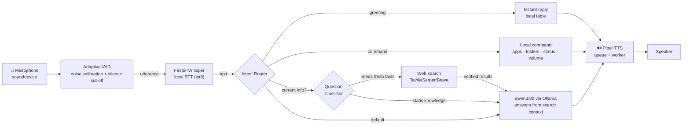

<div align="center">

<br/>


<br/>

**A private, local AI voice assistant for Windows.**

**Microphone → VAD → Faster-Whisper → Intent Router → Ollama (Qwen3) → Piper TTS → Speaker**

Everything — speech recognition, the AI brain, and the voice — runs on your machine. No accounts, no subscriptions, no cloud APIs.

<br/>

| 🎤 Capture | 🧠 Brain | 🔊 Voice |
|---|---|---|
| sounddevice + adaptive VAD | Ollama · `qwen3:8b` (configurable) | Piper neural TTS |
| Faster-Whisper (local STT) | Deterministic command router | No temp WAV files |

<br/>

**Start it from anywhere with one word:**

```powershell
jarvis
```

</div>

---

## ✨ Features

| | Capability | Why it matters |
|---|---|---|
| 🗣️ | **Fully local speech pipeline** | Faster-Whisper STT + Piper TTS run 100% on-device — no internet needed for voice |
| 🎤 | **Adaptive VAD** | Calibrates ambient noise at startup, so it works in quiet and noisy rooms alike |
| 🧠 | **Configurable local brain** | Ollama + `qwen3:8b` by default (swap to `llama3.2:3b` for speed, `qwen3:1.7b` for size) |
| ⚡ | **Streaming replies** | Each finished sentence is spoken while the rest of the answer is still generating |
| 🚀 | **Background warm-up** | The model is pre-loaded at startup, so the first question has no cold-start delay |
| 💬 | **Conversation memory** | Follow-ups like *"Who is Elon Musk?"* → *"What companies does he own?"* just work |
| 🧭 | **Deterministic command router** | Fast, safe local commands (apps, websites, folders, time, date, screenshots, volume, lock) never touch the LLM |
| 🌐 | **Current-information web search** | "Who is the current CM of AP?" → real search results, not stale training data (Tavily/Serper/Brave) |
| 🧠 | **AI is the default route** | Anything the router doesn't match goes to the model — never an "I don't understand" dead-end |
| 🏥 | **`jarvis --doctor`** | 18-point health check with exact fix instructions for anything broken |
| ⚖️ | **`jarvis --benchmark-models`** | Compare models on identical questions and recommend one (never changes config) |
| 🖥️ | **`jarvis --hardware`** | Read-only CPU / RAM / GPU / Ollama report |
| 🖥️ | **Optional desktop GUI** | PySide6 + OpenGL holographic interface (`jarvis --gui`) |
| 🔌 | **Provider-agnostic AI layer** | New providers (Groq, NVIDIA NIM, Gemini) can be added without rewriting JARVIS |

---

## 🧬 Architecture


The same pipeline, GitHub-native Mermaid:



**The pipeline, stage by stage:**

1. **Capture** — `sounddevice` streams 16 kHz mono `int16` audio into memory (`engine/vad.py`).
2. **VAD** — an adaptive RMS threshold is calibrated against ambient noise at startup; 0.7 s of silence ends the phrase.
3. **Transcription** — Faster-Whisper (loaded **once** at startup, `int8` on CPU) transcribes the buffer in memory (`engine/stt.py`).
4. **Routing** — `IntentRouter` classifies the text: *exit → clear memory → instant greeting → stop → command → classifier → AI* (default) (`brain/router.py`).
5. **Classification** — `QuestionClassifier` decides whether the question needs **fresh facts** (politics, news, weather, prices, sports, software versions, ...) or can be answered from the model's knowledge (`brain/classifier.py`).
6. **Web search (current info)** — fresh questions search the web (Tavily/Serper/Brave), rank results by source quality, and hand the *verified* snippets to the LLM so it never answers from stale training data (`brain/search.py`).
7. **Brain** — **qwen3:8b** via Ollama, streamed sentence-by-sentence (`brain/ollama_client.py`).
8. **Speech** — **Piper** synthesizes each reply in memory and plays it through sounddevice (`engine/tts.py`).

### Why this architecture?

**Deterministic commands run *before* the LLM.** Local actions (opening apps, telling time) are frequent, fast, and must behave identically every time. The router gives instant, predictable OS commands; the LLM is reserved for open-ended questions.

**The LLM never executes system commands.** The model produces *spoken text only*. Every OS-level action comes from a fixed mapping in the router — never from model output (see [Security](#-security)).

---

## 🎙️ How JARVIS Hears You


### Adaptive voice activity detection (`engine/vad.py`)

At startup JARVIS samples ~0.6 s of ambient noise and derives a speech threshold:

```
speech threshold = max(VAD_MIN_THRESHOLD, ambient_rms × VAD_THRESHOLD_MULTIPLIER)
```

Quiet rooms floor at a sane minimum; noisy rooms scale with the noise floor, so speech is still detected above it. Recording stops after `VAD_SILENCE_DURATION` of silence, or after `STT_PHRASE_LIMIT` seconds. It never waits forever — if nobody speaks within `STT_TIMEOUT` seconds, it prints "No speech detected — listening..." and keeps going. Silence is never treated as an error.

### Transcription (`engine/stt.py`)

Faster-Whisper runs locally. The model loads once at startup and is reused for every utterance — never re-initialized per sentence. Empty, silent, or failed audio returns *nothing heard* instead of crashing.

### TTS (`engine/tts.py`)

Piper is loaded once at startup. Each reply is synthesized in memory (no temp files) and played through sounddevice from a non-blocking queue, so JARVIS can start speaking the first sentence while the rest is still being generated. If TTS fails, the reply is **printed to the console** and JARVIS keeps listening.

---

## 📦 Requirements

| Requirement | Notes |
|---|---|
| **OS** | Windows 10/11 (primary). Linux/macOS/WSL via `setup.sh` |
| **Python** | 3.10–3.14 |
| **[Ollama](https://ollama.com/download)** | Serves the local brain; only needed for conversational answers |
| **Model** | `ollama pull qwen3:8b` (or configure another in `.env`) |
| **Piper voice** | `python -m piper.download_voices en_US-lessac-medium` (once) |
| **Microphone + speakers** | Any device PortAudio can see |

---

## 🚀 Installation (Windows)

Open **PowerShell** in the repository root and run **one command**:

```powershell
git clone https://github.com/bezawadamahidhar20-droid/JARVIS.git
cd JARVIS
.\install.ps1
```

> If PowerShell blocks the script, run `Set-ExecutionPolicy -Scope Process -ExecutionPolicy Bypass` first.

`install.ps1`:

1. Verifies Python 3.10+ is on PATH.
2. Creates `.venv` (skips if it exists) and installs `requirements.txt`.
3. Installs the **`jarvis` command into your PATH** — from now on you can type `jarvis` in *any* directory.
4. Runs `jarvis --doctor` to verify everything.

### First-time setup (one-time)

```powershell
# 1. Pull the AI model (if you haven't already)
ollama pull qwen3:8b

# 2. Download the Piper voice (if you haven't already)
.\.venv\Scripts\python.exe -m piper.download_voices en_US-lessac-medium

# 3. Optional: edit your settings
Copy-Item .env.example .env
notepad .env
```

---

## 🎬 Using JARVIS

Open a **NEW** terminal (PowerShell or CMD) — **from any directory** — and type:

```powershell
jarvis
```

```
=============================================
              JARVIS ONLINE
              VOICE MODE
=============================================
[+] Configuration loaded
[+] AI engine ready
[+] Speech recognition ready
[+] Voice engine ready
[+] Command router ready
[*] JARVIS is listening...
```

Then just talk.

### The `jarvis` command

| Command | What it does |
|---|---|
| `jarvis` | Start in **voice mode** |
| `jarvis --text` | Chat by typing (no microphone needed) |
| `jarvis --debug` | Verbose debug logging on the console |
| `jarvis --benchmark` | Print per-stage latency after the session |
| `jarvis --benchmark-models` | Benchmark `qwen3:8b` / `qwen3:1.7b` / `llama3.2:3b` on the same questions, score grounding + conciseness, and print a recommendation |
| `jarvis --hardware` | Read-only CPU / RAM / GPU / Ollama / model-size report |
| `jarvis --doctor` | Health check with fix instructions |
| `jarvis --version` | Show the installed version |
| `jarvis --startup enable` | Launch JARVIS automatically at Windows login |
| `jarvis --startup disable` | Remove the auto-start entry |
| `jarvis --gui` | Launch the desktop GUI (PySide6 + OpenGL) |

---

## 🏥 `jarvis --doctor`

A complete health check that never crashes:

```
=============================================
          JARVIS DOCTOR — health report
=============================================
  [✓] Python  3.14.4
  [✓] Virtual environment  C:\Users\YOU\JARVIS\.venv
  [✓] Microphone  Microphone Array (Realtek Audio)
  [✓] Faster-Whisper  base (cpu/int8)
  [✓] Piper  piper-tts installed
  [✓] Voice model  C:\Users\YOU\JARVIS\voices\en_US-lessac-medium.onnx
  [✓] Ollama  http://localhost:11434
  [✓] Selected LLM  qwen3:1.7b
  [✓] Ollama streaming  enabled (sentence-by-sentence TTS)
  [✓] Thinking (reasoning)  disabled (recommended for voice)
  [✓] Model kept alive  qwen3:1.7b loaded (keep_alive 30m)
  [✓] Required directories  voices/, outputs/, data/ present
  [✓] Dependencies  all core packages importable
  [✓] Configuration  .env at C:\Users\YOU\JARVIS\.env
  [✓] Web search  tavily (configured)
  [✓] Search API  configured
  [✓] Common applications  notepad ✓, calculator ✓, chrome ✓, edge ✓, explorer ✓
---------------------------------------------
  All 18 checks passed. JARVIS is ready.
```

Web search is **optional**: without a `SEARCH_API_KEY` the doctor still passes and JARVIS runs in `AI_MODE=local` / answers current-information questions with an honest "couldn't verify" instead of a stale guess.

Each failed check prints an exact **Fix:** line. Example:

```
  [✗] Ollama  http://localhost:11434 not reachable
      Fix: Start the Ollama app, or run:  ollama serve
      Then check http://localhost:11434 in a browser.
```

---

## ⚙️ Configuration (`.env`)

Everything is centralized in `config.py` and read from `.env` (see [`.env.example`](.env.example)). A missing or malformed value never crashes JARVIS — it falls back to a working default.

| Key | Default | Meaning |
|---|---|---|
| `OLLAMA_BASE_URL` | `http://localhost:11434` | Your local Ollama server |
| `OLLAMA_MODEL` | `qwen3:8b` | Baseline AI brain — see [Performance](#-performance) for faster CPU options |
| `JARVIS_MODEL_MODE` | `quality` | `fast` → `OLLAMA_FAST_MODEL` \| `quality` → `OLLAMA_QUALITY_MODEL` (each falls back to `OLLAMA_MODEL`) |
| `OLLAMA_FAST_MODEL` | *(empty)* | Model used in fast mode (e.g. `qwen3:1.7b`) |
| `OLLAMA_QUALITY_MODEL` | *(empty)* | Model used in quality mode (e.g. `qwen3:8b`) |
| `OLLAMA_THINK` | `false` | Suppress Qwen3 reasoning tokens for fast replies |
| `OLLAMA_TIMEOUT` | `120` | Seconds to wait for a reply |
| `OLLAMA_TEMPERATURE` | `0.7` | Creativity (0 strict → 1 wild) |
| `OLLAMA_NUM_PREDICT` | `120` | Max response length (≈3–4 spoken sentences) |
| `OLLAMA_KEEP_ALIVE` | `30m` | How long the model stays loaded in RAM (model warming) |
| `WHISPER_MODEL` | `base` | Faster-Whisper size: `tiny` \| `base` \| `small` ... |
| `WHISPER_COMPUTE_TYPE` | `int8` | `int8` for CPU, `float16` for CUDA |
| `WHISPER_DEVICE` | `cpu` | `cpu` or `cuda` |
| `SAMPLE_RATE` | `16000` | Capture rate (Whisper expects 16 kHz) |
| `INPUT_DEVICE` | *(default mic)* | Numeric input device index |
| `STT_TIMEOUT` | `5` | Seconds to wait for speech to start |
| `STT_PHRASE_LIMIT` | `10` | Max phrase length (seconds) |
| `VAD_CALIBRATE_SECONDS` | `0.6` | Ambient-noise sampling at startup |
| `VAD_THRESHOLD_MULTIPLIER` | `3.0` | Speech threshold = noise × this |
| `VAD_SILENCE_DURATION` | `0.7` | Silence that ends a phrase |
| `TTS_ENGINE` | `piper` | `piper` or `pyttsx3` (SAPI5 fallback) |
| `TTS_VOICE` | `en_US-lessac-medium` | Piper voice name in `voices/` |
| `JARVIS_OWNER` | `Sir` | What JARVIS calls you |
| `AI_PROVIDER` | `ollama` | Provider (extensible) |
| `AI_MODE` | `auto` | `auto` \| `local` \| `web` — when to use web search |
| `SEARCH_PROVIDER` | `tavily` | `tavily` \| `serper` \| `brave` |
| `SEARCH_API_KEY` | *(empty)* | API key for the search provider (empty = disabled) |
| `SEARCH_MAX_RESULTS` | `5` | Results fetched per search |
| `MEMORY_MAX_TURNS` | `6` | Turns of conversation context |
| `ENABLE_WARMUP` | `true` | Pre-load the model at startup |

---

## ⚡ Performance

Measured on a **CPU-only** laptop (no GPU), all stages warm:

| Stage | Latency |
|---|---|
| Whisper transcription (2.9 s audio) | ~0.9 s |
| Tavily web search (5 results) | ~1.0 s |
| Prompt construction | <5 ms |
| Piper TTS synthesis (one sentence) | ~0.3 s |
| **Qwen3:8b generation** | **~2.5 tokens/s** (TTFT ~4 s) |

**The bottleneck is the LLM on CPU**, not JARVIS. Everything before the model answers in ~2 s; the model then takes 20–40 s for a 3-sentence reply on a CPU-only machine.

What already helps (all enabled by default):

* **`OLLAMA_THINK=false`** — Qwen3's hidden reasoning tokens are the single biggest win: with thinking on, the first word arrives after ~40 s; with it off, ~4 s. Verified to reach Ollama (see `jarvis --doctor`).
* **`OLLAMA_KEEP_ALIVE=30m`** — keeps the model in RAM so only the *first* question after boot pays the ~50 s cold load.
* **Streaming + sentence TTS** — the first sentence is spoken while the rest is still generating.
* **Warm-up coordination** — the first question waits for the background load instead of racing it (no double cold-start).

**Measure your own machine** with `jarvis --benchmark-models` — it runs the same 6 questions (conversation, knowledge, a current-info question answered from **mocked** Tavily results, and command-style) through every candidate and prints load time, prompt eval, first-token latency, tokens/sec, quality, and grounding.

Measured on this machine's CPU-only hardware (warm, all 3 models fully grounded on the web question):

| Model | LOAD (s) | TTFT (s) | tok/s | Avg total (s) | Quality |
|---|---|---|---|---|---|
| `qwen3:8b` | 13.7 | 5.5 | 3.5 | 14.3 | 1.00 |
| `qwen3:1.7b` | 5.0 | 3.3 | **14.4** (**4.1×**) | **5.3** | 1.00 |
| `llama3.2:3b` | 6.4 | 3.9 | 8.4 (2.4×) | 8.2 | 0.99 |

`qwen3:1.7b` matched `qwen3:8b` on quality **and** web grounding at ~4× the speed, so it is the recommended CPU model — set it once and keep `qwen3:8b` one switch away:

```
JARVIS_MODEL_MODE=fast          # quality  → uses OLLAMA_QUALITY_MODEL
OLLAMA_FAST_MODEL=qwen3:1.7b
OLLAMA_QUALITY_MODEL=qwen3:8b   # OLLAMA_MODEL stays the baseline
```

The recommendation is advisory only — `--benchmark-models` never changes your configuration. A GPU (or a smaller model) is required for sub-10-second replies — no client-side setting can make an 8B model generate faster on CPU.

Per-stage timings are logged to `jarvis.log` (`[timing] ...`) and `jarvis --doctor` now reports streaming / thinking / keep-alive status.

---

## 🗺️ Supported Commands

Anything the router doesn't match is sent to **qwen3:8b** for a conversational answer.

| You say | What happens |
|---|---|
| "Hello JARVIS" / "Who are you" | **Instant canned reply** — no AI call |
| "What time is it?" / "What's the date?" | Local clock / calendar |
| "Open YouTube" / "Go to GitHub" | Opens the website in your browser |
| "Open notepad" / "Open calculator" | Launches the app |
| "Open Chrome" / "Open VS Code" | Launches the installed app (safe detection, friendly "not installed" reply) |
| "Open settings" / "Open file explorer" | Opens Windows Settings / Explorer |
| "Open my downloads" / "Open documents" | Opens the user's folder (known-folder API) |
| "Take a screenshot" | Saves a timestamped PNG into `Pictures/JARVIS/Screenshots/` (never overwrites) |
| "System status" / "How is my computer" | CPU / RAM / disk readout |
| "Increase volume" / "Set volume to 50 percent" | Windows volume control (requires `pycaw`; reports clearly if unavailable) |
| "Lock my computer" | Locks the Windows session |
| "Shut down / restart / sleep my computer" | **Asks for confirmation first**, runs only after an explicit "yes" |
| "Abort shutdown" | Cancels a scheduled shutdown |
| "Stop speaking" | Interrupts TTS immediately |
| "Switch to fast mode" / "Use the quality model" | Switches the active Ollama model at runtime — no restart, no LLM round-trip (see `JARVIS_MODEL_MODE`) |
| "Which model are you using?" | Reports the current mode + model |
| "Who is the current CM of AP?" | **Web search** — answered from verified results with sources shown in the terminal |
| "What is the latest news?" | **Web search** — current information |
| "Clear memory" | Forgets the conversation |
| "Goodbye" / "Exit" / "Quit" / "Shutdown JARVIS" | Gracefully shuts down |
| *anything else* | Answered by the AI model |

> The full app/website/folder catalog lives in `commands/system_commands.py`.

### 🌐 Current information vs local knowledge (`AI_MODE`)

JARVIS never answers *current* questions from its training data:

| Mode | Behavior |
|---|---|
| `auto` (default) | A small classifier decides: "who is the current CM?", "latest news", "today's weather", "Bitcoin price" → **web search**. "What is Python?", "explain recursion" → **local LLM** |
| `local` | Always answer from the local LLM (no search, fully offline) |
| `web` | Always search before answering |

When the search cannot verify the information (no API key, search failure, no results), JARVIS says **"I couldn't verify the latest information right now"** instead of guessing or hallucinating. Web answers show their sources in the terminal (`[Sources] ...`) but keep the voice reply short — URLs are never read aloud.

---

## 🔒 Security

- **Command routing is deterministic.** Local actions come only from fixed, registered `Command` objects (`commands/registry.py`). They are never constructed from arbitrary text.
- **LLM output is never executed.** The model's response is text spoken by TTS only. It cannot launch processes or run shell commands.
- **No arbitrary shell execution.** There is no `LLM → PowerShell → computer` path. Only explicitly registered commands execute, through `LLM → recognized intent → registered safe command → permission validation → execution`.
- **Permission levels.** `SAFE` commands run immediately; `CONFIRM` commands (shutdown/restart/sleep) only run after an explicit "yes"; anything else (arbitrary shell, file deletion, `kill process X`, credential access) is **BLOCKED** — it never reaches the OS.
- **Windows commands are explicitly mapped** (`subprocess.Popen` / `os.startfile` with hardcoded targets).

---

## 🧪 Testing

The test suite runs entirely with mocks — no microphone, speakers, or AI server required:

```powershell
.\.venv\Scripts\python.exe -m pip install pytest
.\.venv\Scripts\python.exe -m pytest tests/ -q
```

351 tests cover configuration, routing, the question classifier, web-search providers (mocked HTTP), commands + permission levels, Ollama (mocked HTTP), memory, VAD, STT, TTS, microphone detection, the doctor, the CLI, wake-name normalization, model-mode selection, the model benchmark, the hardware report, and shutdown behavior.

---

## ⏱️ Performance

- Models load **once** at startup (Whisper + Piper + Ollama warm-up) and are reused.
- `OLLAMA_STREAM=true` + `OLLAMA_THINK=false` → the first sentence is spoken while the rest generates.
- `OLLAMA_KEEP_ALIVE=30m` keeps the model resident in RAM.
- `jarvis --benchmark` prints per-stage latency (listen / process / speak) for the whole session.

**Honest expectations:** local CPU inference is slower than cloud APIs. The first question after a cold start is the slowest (model loading); later questions are fast. Hardware dominates — latency scales with your CPU/RAM.

---

## 🛠️ Troubleshooting

**`jarvis` is not recognized as a command**
- Run `.\install.ps1` inside the repository, then open a **NEW** terminal.
- Verify with: `jarvis --version`

**`[✗] Ollama` in `jarvis --doctor`**
- Start the Ollama app, or run `ollama serve`. Check <http://localhost:11434>.

**`[✗] Selected LLM` in `jarvis --doctor`**
- Run `ollama pull qwen3:8b` (or whatever `OLLAMA_MODEL` is set to).

**`[✗] Voice model` in `jarvis --doctor`**
- Download the Piper voice once: `.\.venv\Scripts\python.exe -m piper.download_voices en_US-lessac-medium`

**No microphone / JARVIS hears nothing**
- Check Windows Sound settings → Input.
- Run `jarvis --text` to use JARVIS without a mic.
- Keep the room quiet while JARVIS speaks (no echo cancellation).

**No sound from JARVIS**
- Check your default output device. If TTS fails, replies still print to the console.

**The first AI answer is slow**
- That's the model cold-starting into RAM. `ENABLE_WARMUP=true` and `OLLAMA_KEEP_ALIVE=30m` keep later questions fast. Raise `OLLAMA_TIMEOUT` if it ever times out.

**Audio is mis-detected (cuts off / never starts)**
- Tune VAD in `.env`: `VAD_THRESHOLD_MULTIPLIER`, `VAD_SILENCE_DURATION`, `VAD_MIN_THRESHOLD`.

---

## 📁 Project Structure

```
JARVIS/
├── jarvis.cmd              # Windows launcher shim (run `jarvis` from anywhere)
├── jarvis                  # Unix launcher (Linux / macOS / WSL)
├── install.ps1             # One-command Windows installer (venv + PATH + doctor)
├── setup.sh                # One-command Unix installer
├── pyproject.toml          # Packaging + `jarvis` console script
├── requirements.txt        # Runtime dependencies
├── requirements-dev.txt    # Test dependencies (pytest, ruff)
├── main.py                 # JARVIS orchestrator: initialize → listen loop → shutdown
├── config.py               # All settings, typed safe getters from .env
├── .env                    # YOUR settings (never committed)
├── .env.example            # Template with defaults & comments
├── jarvis_cli/             # The `jarvis` command
│   ├── __main__.py         # Entry point (run from any directory)
│   ├── __init__.py         # CLI: --help/--version/--doctor/--benchmark-models/--hardware/...
│   ├── doctor.py           # 18-point health check
│   ├── benchmark.py        # `--benchmark-models`: compare models + recommend
│   ├── hardware.py         # `--hardware`: CPU/RAM/GPU/Ollama report
│   └── startup.py          # Windows auto-start enable/disable
├── brain/                  # The brain
│   ├── llm.py              # Provider-agnostic AI layer (LLMProvider + factory)
│   ├── ollama_client.py    # Ollama /api/chat (streaming, think:false, timing, search context)
│   ├── classifier.py       # Question classifier: web search vs local LLM (AI_MODE)
│   ├── search.py           # Web search providers (Tavily/Serper/Brave) + result ranking
│   ├── memory.py           # Rolling conversation memory
│   └── router.py           # Intent routing: EXIT / CLEAR / FAST / STOP / COMMAND / WEB_SEARCH / AI
├── engine/                 # Audio I/O
│   ├── vad.py              # Adaptive VAD (noise calibration, silence cut-off)
│   ├── microphone.py       # Mic detection + diagnostics
│   ├── stt.py              # Faster-Whisper STT (loaded once)
│   └── tts.py              # Piper TTS (loaded once, queue + worker)
├── commands/               # Local actions
│   ├── registry.py         # Command objects + SAFE/CONFIRM permissions
│   ├── system_commands.py  # Apps, websites, folders, status, volume, lock, power
│   └── time_commands.py    # Time & date
├── utils/
│   ├── logger.py           # Console + file logging (debug via --debug)
│   └── dataset.py          # Fine-tuning dataset helpers
├── jarvis_ui/              # Desktop GUI (PySide6 + OpenGL) — `jarvis --gui`
├── voices/                 # Piper voices (git-ignored, downloaded once)
├── tests/                  # pytest suite (93 tests, all mocked)
└── tools/                  # Fine-tuning pipeline
```

---

## 🗺️ Roadmap

- **Wake-word detection** — activate JARVIS only after a hotword.
- **Interruption / barge-in** — stop speaking when the user talks.
- **More providers** — Groq, NVIDIA NIM, Gemini via `brain/llm.py`.
- **More desktop commands** — broader app catalog and window control.

---

## 📜 License

Distributed under the **MIT License**. See [LICENSE](LICENSE).

---

<div align="center">

**Made with ⚡ on Earth — your brain stays on your machine.**

</div>
