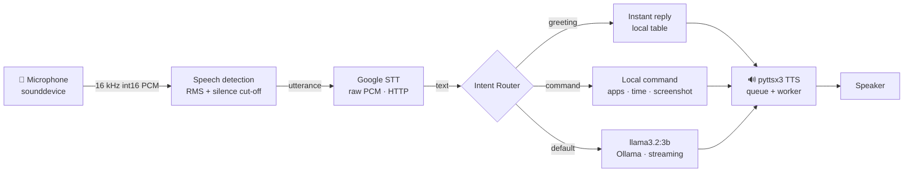

<div align="center">

<br/>


<br/>

**JARVIS** is a private, hands-free AI voice assistant for **Windows** — powered by a locally-served **llama3.2:3b** brain, on-device speech detection, Google speech recognition, and instant system commands.

**No accounts. No subscriptions. No API keys to buy. Your AI brain lives on your PC.**

<br/>

[](https://www.python.org)
[](https://cloud.google.com/speech-to-text)
[](https://pypi.org/project/pyttsx3/)
[](https://ollama.com)
[](https://doc.qt.io/qtforpython/)
[]()
[](LICENSE)

</div>

---

## ⚡ Project Status

**Active personal project.** The end-to-end pipeline — *mic → speech detection → STT → router/LLM → TTS* — is working and tuned on the author's Windows machine, with two front-ends: a fast voice/text terminal loop and a full **60 fps OpenGL desktop UI** with a live 3D holographic core, particle field, waveform, and boot animation. This is a hobby-grade assistant: no releases, no version guarantees, no stable public API. Expect it to perform best in the environment it was tuned for.

---

## ✨ Features

| | Capability | Why it matters |
|---|---|---|
| 🎤 | **No PyAudio, no FLAC** | Microphone capture uses `sounddevice`; speech recognition posts raw PCM straight to Google's HTTP API. Works on Python 3.10–3.14 Windows 11, where PyAudio and the bundled `flac.exe` both fail |
| ⚡ | **Streaming replies** | Tokens arrive as they're generated (`ask_stream()`); each finished sentence is spoken immediately while the rest of the answer is still being written |
| 🤝 | **Instant canned greetings** | 20+ replies ("hello", "who are you", "good night", …) answered from a local table — zero AI round-trip |
| 🚀 | **Background warm-up** | The model is pre-loaded into RAM in a background thread at startup, so the first question has no cold-start delay |
| 💬 | **Conversation memory** | Follow-ups like *"Who is Elon Musk?"* → *"What companies does he own?"* just work |
| 🧭 | **Deterministic command router** | Fixed, safe local commands (apps, websites, time, date, screenshots) execute instantly and predictably |
| 🧠 | **AI is the default route** | Anything the router doesn't match goes to the model — never an "I don't understand" dead-end |
| 📊 | **Rich terminal dashboard** | Live Rich panels: system status, session stats, per-stage latency, console feed, and a real audio-level bar |
| 🖥️ | **60 fps desktop GUI** | PySide6 + OpenGL hologram: rotating 3D neural sphere, particle field, waveform, HUD panels, boot/scan-line/glitch animations |
| 🧪 | **Fine-tuning pipeline** | Log real conversations, build a dataset, and fine-tune your own JARVIS brain from a Jupyter notebook |

---

## 🧬 Architecture


For a GitHub-native rendering, the same pipeline in Mermaid:



**The pipeline, stage by stage:**

1. **Capture** — `sounddevice` streams 16 kHz mono `int16` audio straight into memory (`engine/microphone.py`).
2. **Speech detection** — an RMS threshold separates speech from silence; 0.7 s of quiet ends the phrase (`engine/stt.py`).
3. **Transcription** — raw 16-bit PCM is posted to Google's speech API (`audio/l16`, no FLAC) and the transcript is parsed from the NDJSON reply (`engine/stt.py`).
4. **Routing** — `IntentRouter` classifies the text: *exit → clear memory → instant greeting → command → AI* (default) (`brain/router.py`).
5. **Brain** — unmatched questions go to **llama3.2:3b** through Ollama, streamed sentence-by-sentence (`brain/ollama_client.py`).
6. **Speech** — `pyttsx3` (Windows SAPI5) speaks each reply from a non-blocking queue (`engine/tts.py`).

### Why this architecture?

**Deterministic commands run *before* the LLM.** Local actions (opening apps, telling time/date) are frequent, fast, and must behave identically every time. An LLM is neither fast enough nor reliable enough for that. The router gives instant, predictable OS commands; the LLM is reserved for open-ended questions where flexibility is the point.

**llama3.2 never executes system commands.** The LLM only produces *spoken text*. Every OS-level action comes from a fixed mapping in the router — never from model output (see [Security](#-security)).

---

## 🎙️ How JARVIS Hears You


### 🔇 1. Speech detection & capture

`engine/stt.py` records one phrase with `sounddevice`:

- Audio streams in 0.05 s chunks as 16 kHz mono `int16` PCM.
- A chunk is "speech" when its RMS exceeds a silence threshold; recording arms on the first speech and stops after 0.7 s of silence.
- Utterances shorter than ~3 chunks are ignored as noise blips; the phrase is capped at 10 s and JARVIS waits at most 5 s for speech to start.
- The whole utterance stays **in memory** — no WAV files in the production path.

### 📝 2. Speech recognition

The captured buffer is posted as raw `audio/l16` PCM to Google's speech-recognition HTTP endpoint — **no PyAudio, no FLAC subprocess**, no temp files. This is what makes JARVIS work on Python 3.14 Windows 11 where `SpeechRecognition`'s bundled `flac.exe` fails with `[WinError 50]`.

> **Network note:** this is the one step that touches the internet. It sends a few seconds of audio to Google's free endpoint (a built-in key is used by default; set `GOOGLE_STT_KEY` to override). Everything else — the brain and the voice — runs 100% on your machine. See [Privacy](#-privacy).

---

## 🧠 The Brain

```
      USER QUESTION
           │
           ▼
   ┌── INTENT ROUTER ──┐
   │                    │
   ▼        ▼           ▼
GREETING  COMMAND   llama3.2:3b
   │        │           │
   └────────┴────┬──────┘
                ▼
            RESPONSE
```

| Route | Mechanism | Behavior |
|---|---|---|
| **Instant greeting** | Local lookup table in `brain/router.py` | Reply is spoken immediately — no AI call |
| **Deterministic command** | Regex patterns + `commands/registry.py` | Opens apps/sites, tells time/date, screenshots |
| **Conversational AI** | llama3.2:3b via Ollama (`brain/ollama_client.py`) | Open-ended answers, streamed aloud by TTS |
| **Clear memory** | `ConversationMemory.clear()` | Forgets the conversation and starts fresh |
| **Exit** | Exact phrase match | Says goodbye and shuts down |

**Why this is safer:** local OS actions never pass through natural language. The LLM's output is *text only* — it cannot launch processes or run shell commands. Only pre-approved mappings in the router ever execute (see [Security](#-security)).

### Conversation memory

`brain/memory.py` keeps a rolling window of recent turns. On every request the history is sent to Ollama, so follow-ups resolve correctly:

```
[USER]   Who is Elon Musk?
[USER]   What companies does he own?
[JARVIS] "He" resolves to Elon Musk from the conversation history.
```

`MEMORY_MAX_TURNS` (default 6) and `MEMORY_MAX_CHARS` (default 3000) keep prompts short — older turns are dropped in pairs when the limit is hit.

---

## 🔊 Giving JARVIS a Voice

`engine/tts.py` wraps **pyttsx3** (Windows SAPI5) in a queue + daemon worker so `speak()` never blocks the caller:

```
    TEXT
     │
     ▼
 PYTTsX3 QUEUE ──► SAPI5 VOICE ──► SPEAKER
```

- **Non-blocking** — sentences are queued and a worker thread speaks them one at a time; the main thread keeps generating the next sentence.
- **Streaming** — in voice mode, each completed sentence of the model's reply is spoken as it arrives.
- **Echo guard** — `wait()` drains the queue before the mic re-arms, so JARVIS never hears its own voice.
- **Never fatal** — if the engine breaks, the reply is still printed and JARVIS keeps running.
- Markdown noise (`**`, backticks, links) is stripped before speaking.

---

## ⚙️ How It Works (a single turn)

In `main.py`, one spoken turn flows through:

1. **Listen** — JARVIS waits until it has finished speaking, then records one phrase.
2. **Transcribe** — the in-memory PCM buffer is sent to Google STT.
3. **Filter** — empty/too-short transcriptions are treated as noise and ignored.
4. **Exit check** — exit phrases trigger *"Goodbye."* and shutdown.
5. **Route** — the text goes through `IntentRouter` (greeting → command → AI default).
6. **Act / Answer** — a matched command executes locally; otherwise llama3.2:3b streams a concise reply.
7. **Speak** — each sentence is cleaned and spoken by the TTS queue. Stage latency is logged as
   `[timing] first token 0.8s | total 3.2s | 47 tokens`.

> If Ollama is down or the model is missing at startup, JARVIS still runs — it logs a warning and local commands keep working; only conversational questions are unavailable.

---

## 🖥️ The Interface

JARVIS ships with **two** front-ends for the same brain.

### 1. Terminal loop (`python main.py`)

A plain, fast voice/text loop. `--text` mode lets you chat without a microphone:

```powershell
python main.py          # voice mode
python main.py --text   # text mode (no mic needed)
```

### 2. Desktop GUI (`python jarvis_ui/ui_main.py`)

A cinematic **60 fps OpenGL dashboard** built with PySide6 (Qt6). It renders a live **3D holographic neural sphere**, a flowing waveform, an ambient particle field, HUD panels with CPU/RAM, a conversation feed, and a full boot sequence with scan-line and glitch overlays.

```
+--------------------------------------------------+
|  TOP BAR: JARVIS logo + status + time + date      |
+--------------------------------------------------+
| LEFT PANEL |   CENTER 3D SPHERE + WAVEFORM   | RIGHT |
| (AI NEURAL |   (OpenGL hologram)            | (CORE)|
+--------------------------------------------------+
|  BOTTOM BAR: mic + text input + quick commands   |
+--------------------------------------------------+
```

**Keyboard shortcuts**

| Key | Action |
|---|---|
| `SPACE` | Toggle microphone |
| `T` | Focus the text input |
| `C` | Clear conversation memory |
| `ESC` | Exit JARVIS |

The GUI reads live audio levels for the waveform, tracks module status (mic, STT, router, Ollama, TTS), and streams every reply onto the sphere. Install the GUI extras with `pip install -r jarvis_ui/requirements_ui.txt`.

---

## 🛠️ Technology Stack

| Layer | Tool | Notes |
|---|---|---|
| 🎤 **Audio I/O** | [sounddevice](https://python-sounddevice.readthedocs.io) | PortAudio bindings, 16 kHz mono `int16` |
| 🔇 **Speech detection** | Custom RMS threshold | Silence cut-off + phrase cap |
| 📝 **Speech-to-text** | Google speech API (raw PCM HTTP) | `audio/l16`, no PyAudio, no FLAC |
| 🧠 **Language model** | [llama3.2:3b](https://ollama.com/library/llama3.2) via [Ollama](https://ollama.com) | Streaming, `keep_alive` 30 min |
| 🔊 **Text-to-speech** | [pyttsx3](https://pypi.org/project/pyttsx3/) | Windows SAPI5, queue + worker |
| 🧭 **Routing** | `IntentRouter` + `CommandRegistry` | Deterministic, safe mappings |
| 🖥️ **Desktop GUI** | [PySide6](https://doc.qt.io/qtforpython/) + [PyOpenGL](https://pypi.org/project/PyOpenGL/) | 3D sphere, particles, waveform, HUD |
| 🗒️ **Terminal dashboard** | [Rich](https://rich.readthedocs.io) | Live panels + audio level bar |
| 🧰 **Utilities** | NumPy · Requests · python-dotenv · pyautogui · Pillow | |

---

## 📦 Requirements

| Requirement | Notes |
|---|---|
| **OS** | Windows 10/11 (command router + SAPI5 voice assume Windows) |
| **Python** | 3.10–3.14 (tested on 3.14 Windows 11) |
| **Git** | To clone the repository |
| **[Ollama](https://ollama.com/download)** | Runs llama3.2 locally; only needed for conversational answers |
| **Microphone + speakers** | Any input/output device PortAudio can see |
| *(GUI only)* **GPU with OpenGL** | Falls back gracefully; a basic OpenGL 2.1 context is enough |

Base dependencies (`requirements.txt`):

| Package | Used by |
|---|---|
| `SpeechRecognition` | Compatibility wrapper (STT uses its own HTTP client) |
| `pyttsx3` | Text-to-speech (Windows SAPI5) |
| `requests` | Ollama client + Google STT |
| `python-dotenv` | Loads `.env` settings |
| `pyautogui` / `pillow` | Screenshots |
| `sounddevice` | Microphone capture (bundles its own PortAudio DLLs) |

GUI extras (`jarvis_ui/requirements_ui.txt`): `PySide6`, `PyOpenGL`, `psutil`, `numpy`, `sounddevice`.

---

## 🚀 Installation

Open **PowerShell** and run each block from top to bottom.

### 1. Clone the repository

```powershell
git clone https://github.com/bezawadamahidhar20-droid/JARVIS.git
cd JARVIS
```

### 2. Create and activate a virtual environment

```powershell
python -m venv .venv
.\.venv\Scripts\Activate.ps1
```

> If PowerShell blocks the activation script, run `Set-ExecutionPolicy -Scope Process -ExecutionPolicy Bypass` first.

### 3. Install dependencies

```powershell
pip install -r requirements.txt
```

Optionally add the GUI:

```powershell
pip install -r jarvis_ui/requirements_ui.txt
```

No PyAudio needed. The microphone uses `sounddevice` (bundles its own PortAudio DLLs), and speech recognition hits Google's HTTP API directly, so nothing extra has to compile on Python 3.14.

### 4. Configure your settings

```powershell
Copy-Item .env.example .env
notepad .env
```

Edit anything you like (owner name, TTS rate, model, …). All values have working defaults, so this step is optional.

### 5. Pull the llama3.2 model into Ollama

```powershell
ollama pull llama3.2:3b
```

Make sure Ollama is running (the Ollama app does this automatically, or run `ollama serve`). Verify it's up: open <http://localhost:11434> in a browser — you'll see "Ollama is running".

### 6. Run JARVIS

Terminal, voice mode:

```powershell
python main.py
```

Terminal, text mode (no mic needed — great for testing):

```powershell
python main.py --text
```

Desktop GUI (3D hologram interface):

```powershell
python jarvis_ui/ui_main.py
```

---

## ⚙️ Configuration (`.env`)

Everything lives in [`.env.example`](.env.example) and is loaded by `config.py` with typed, safe getters — a missing or malformed value never crashes JARVIS.

| Key | Default | Meaning |
|---|---|---|
| `OLLAMA_BASE_URL` | `http://localhost:11434` | Your local Ollama server |
| `OLLAMA_MODEL` | `llama3.2:3b` | Model used as the brain |
| `OLLAMA_TIMEOUT` | `120` | Seconds to wait for a reply |
| `OLLAMA_TEMPERATURE` | `0.7` | Creativity (0 strict → 1 wild) |
| `OLLAMA_STREAM` | `true` | Stream tokens for instant first sentence |
| `OLLAMA_NUM_PREDICT` | `150` | Max response length (tokens) — alias `MAX_RESPONSE_TOKENS` |
| `OLLAMA_NUM_CTX` | `2048` | Context window size (smaller = faster prompts) |
| `OLLAMA_KEEP_ALIVE` | `30m` | How long the model stays loaded in RAM |
| `OLLAMA_NUM_GPU` | `99` | GPU offload (ignored on CPU-only boxes) |
| `STT_LANGUAGE` | `en-US` | Speech-recognition language |
| `STT_TIMEOUT` | `5` | Seconds to wait for speech to start |
| `STT_PHRASE_LIMIT` | `10` | Max phrase length (seconds) |
| `STT_SILENCE_DURATION` | `0.7` | Seconds of silence that ends a phrase |
| `STT_CHUNK_DURATION` | `0.05` | Audio chunk length (seconds) |
| `GOOGLE_STT_KEY` | *(built-in)* | Google speech API key |
| `TTS_RATE` | `200` | Speaking rate (words/min) |
| `JARVIS_NAME` | `JARVIS` | Assistant name |
| `JARVIS_OWNER` | `Sir` | What JARVIS calls you |
| `MEMORY_MAX_TURNS` | `6` | How many turns of context to remember |
| `MEMORY_MAX_CHARS` | `3000` | Max characters of history per request |
| `ENABLE_FAST_RESPONSES` | `true` | Instant canned greeting replies |
| `ENABLE_WARMUP` | `true` | Pre-load the model at startup |

---

## 🚀 First Run

```powershell
python main.py
```

You should see:

```
=============================================
              JARVIS ONLINE
              VOICE MODE
=============================================
```

Then speak. A realistic turn (timing values are **illustrative only** — they depend entirely on your hardware):

```
[You said: what is python]
[Thinking...]
[JARVIS] Python is a high-level, general-purpose programming language
         known for its readability.
[timing] first token 0.8s | total 3.2s | 47 tokens
```

Say *"what time is it"*, *"open YouTube"*, *"what is the capital of France?"* — or simply *"goodbye"* to shut down.

---

## 🗺️ Supported Commands

Anything the router doesn't match is sent to **llama3.2:3b** for a conversational answer.

| You say | What happens |
|---|---|
| "Hello JARVIS" / "Who are you" | **Instant canned reply** — no AI call |
| "What time is it?" / "What's the date?" | Local clock / calendar |
| "Open YouTube" / "Go to GitHub" | Opens the website in your browser |
| "Open notepad" / "Open calculator" | Launches the app |
| "Open Chrome" / "Open VS Code" | Launches the installed app |
| "Open settings" / "Open file explorer" | Opens Windows Settings / Explorer |
| "Take a screenshot" | Saves a PNG into `outputs/` |
| "Volume up" / "Mute" | Adjusts system volume |
| "Play" / "Next track" | Media transport |
| "Shut down the computer" | Lock / sleep / restart / shutdown |
| "Clear memory" | Forgets the conversation |
| "Goodbye" / "Exit" | Gracefully shuts down |
| *anything else* | Answered by llama3.2:3b |

> The full app/website catalog lives in `commands/system_commands.py`. If JARVIS reports it can't open something, check the target is installed (e.g. Chrome is found via `LOCALAPPDATA` and the standard `Program Files` paths).

---

## 💬 Conversational Examples

Questions are answered by llama3.2:3b locally. Output is illustrative — the exact wording varies.

```
[USER]   What is Python?
[JARVIS] Python is a high-level, general-purpose programming language widely used
         for web development, data science, and automation.

[USER]   Explain recursion in simple words.
[JARVIS] Recursion is when a function calls itself to solve a smaller version of
         the same problem, until it reaches a base case.

[USER]   What is the capital of France?
[JARVIS] The capital of France is Paris.
```

---

## ⏱️ Speed Tuning

The stack is tuned for low latency on CPU:

| Feature | What it does |
|---|---|
| `OLLAMA_STREAM=true` | Tokens arrive as generated; the first sentence is spoken while the rest renders |
| `OLLAMA_KEEP_ALIVE=30m` | Model stays loaded in RAM — no cold reload between questions |
| `OLLAMA_NUM_PREDICT=150` | Caps answers at ~3 sentences, no rambling |
| `OLLAMA_NUM_CTX=2048` | Smaller context window = faster prompt processing |
| `MEMORY_MAX_TURNS=6` + `MEMORY_MAX_CHARS=3000` | Trims old turns so prompts stay short |
| `ENABLE_FAST_RESPONSES=true` | Greetings answered instantly from a local table |
| `ENABLE_WARMUP=true` | Background thread pre-loads the model at startup |
| `STT_SILENCE_DURATION=0.7` | Faster phrase cut-off than the old 1.2 s |
| `STT_CHUNK_DURATION=0.05` | Snappier speech-onset detection |

### Honest expectations

- **Local CPU inference is slower than cloud APIs.** llama3.2 runs on your CPU unless you configure GPU acceleration in Ollama.
- **Model warm-up matters.** The first request after a cold start is noticeably slower while the model loads into memory. `keep_alive: 30m` keeps it resident between turns to avoid reloads.
- **Hardware dominates.** Ollama latency scales directly with your CPU/RAM. A weak CPU will make turns take several seconds.
- Timing is logged for every interaction as `[timing] first token 0.8s | total 3.2s | 47 tokens`.

---

## 🎓 Fine-Tuning Your JARVIS

JARVIS records real conversations to `data/conversations.jsonl` and ships a full fine-tuning pipeline so you can train a JARVIS-flavoured model:

1. **Collect** — conversations are appended to `data/conversations.jsonl` as you use JARVIS.
2. **Prepare** — `tools/prepare_dataset.py` converts the raw log into a training dataset (`data/dataset.json`).
3. **Train** — open `tools/finetune_qwen3.ipynb` to fine-tune, quantize, and export a GGUF model.
4. **Serve** — `ollama create jarvis-ft -f Modelfile` and point `OLLAMA_MODEL` at it.

Helpers live in `utils/dataset.py`. This keeps the base repo dependency-light — the notebook pulls in whatever training stack you prefer.

---

## 🛠️ Troubleshooting

**"Cannot reach Ollama at http://localhost:11434"**
- Ollama isn't running. Start the Ollama app or run `ollama serve`.
- Check <http://localhost:11434> in your browser.

**"Model 'llama3.2:3b' is not installed"**
- Run `ollama pull llama3.2:3b`.

**The first AI answer feels slow**
- That's the model cold-starting into RAM on the very first run after a reboot. The background warm-up and `OLLAMA_KEEP_ALIVE=30m` keep every later question fast. Raise `OLLAMA_TIMEOUT` if it ever times out.

**"No microphone found"**
- Check your mic is plugged in and not disabled in Windows Sound settings.
- Run `python main.py --text` to test without a mic.

**Speech isn't being recognized / JARVIS hears nothing**
- Check the mic isn't muted (Windows Sound → Input).
- JARVIS only listens once it has finished speaking (echo guard), so keep the room quiet while it talks.
- STT needs an internet connection (the one cloud step) — without it, only commands and canned replies work.

**No sound from JARVIS**
- Check your default output device. pyttsx3 uses Windows SAPI5 voices.
- JARVIS still prints replies to the console, so the loop keeps working.

**The AI answers are full of markdown (`**`, `##`, backticks)**
- They shouldn't be — the system prompt forbids markdown and both the Ollama client and the TTS layer strip it. If you still see it, the reply you heard is the clean version; the console shows the raw model output.

**The GUI won't start / shows a black sphere**
- Ensure `PySide6` and `PyOpenGL` are installed (`pip install -r jarvis_ui/requirements_ui.txt`).
- A basic OpenGL 2.1 compatibility context is requested; very old or virtual GPUs may need updated drivers.

---

## 📁 Project Structure

```
JARVIS/
├── main.py                  # JARVIS class + main loop (voice & --text modes)
├── config.py                # Typed safe getters; loads all settings from .env
├── .env                     # YOUR settings (never commit this)
├── .env.example             # Template with defaults & comments
├── requirements.txt         # Runtime dependencies
├── brain/                   # The brain
│   ├── ollama_client.py     # llama3.2:3b via Ollama /api/chat (streaming + timing)
│   ├── memory.py            # Rolling conversation memory (follow-ups!)
│   └── router.py            # Intent routing: EXIT / CLEAR / FAST / COMMAND / AI
├── commands/                # Local actions
│   ├── registry.py          # Dispatches matched commands
│   ├── system_commands.py   # Apps, websites, screenshots, media, power
│   └── time_commands.py     # Time & date
├── engine/                  # Audio I/O
│   ├── microphone.py        # sounddevice mic source (no PyAudio)
│   ├── stt.py               # Capture → Google STT via HTTP (raw PCM, no FLAC)
│   └── tts.py               # pyttsx3 queue + daemon worker (non-blocking)
├── utils/
│   ├── logger.py            # Console + file logging with per-stage timing
│   ├── terminal_ui.py       # Rich live terminal dashboard
│   └── dataset.py           # Conversation → dataset helpers (fine-tuning)
├── jarvis_ui/               # Desktop GUI (PySide6 + OpenGL)
│   ├── ui_main.py           # Main window + 60 fps animation loop
│   ├── ui_state.py          # State machine, controller, monitor threads
│   ├── widgets/             # sphere_3d, waveform, particles, brain_map, HUD
│   ├── animations/          # boot sequence, scan line, glitch, transitions
│   └── requirements_ui.txt  # GUI dependencies
├── tools/                   # Fine-tuning pipeline
│   ├── prepare_dataset.py   # conversations.jsonl → dataset.json
│   └── finetune_qwen3.ipynb # Fine-tune + quantize + export notebook
├── data/                    # conversation logs + training datasets (git-ignored)
├── outputs/                 # screenshots (git-ignored)
├── docs/                    # Animated visual assets
│   ├── hero-core.svg        # 3D animated holographic core (hero)
│   ├── architecture-animated.svg  # Animated pipeline diagram
│   ├── voice-pipeline.svg   # Voice-processing illustration
│   └── architecture.svg     # Static architecture diagram
├── LICENSE                  # MIT License
└── README.md
```

Key entry points: `main.py` runs the assistant; `config.py` + `.env` tune behavior; `jarvis_ui/ui_main.py` launches the desktop GUI.

---

## 🏗️ Design Decisions

### sounddevice + Google STT (speech-to-text)
`sounddevice` bundles its own PortAudio DLLs, so microphone capture needs nothing to compile on Python 3.13/3.14. Sending raw `audio/l16` PCM straight to Google's HTTP endpoint skips `SpeechRecognition`'s FLAC subprocess — the thing that crashes with `[WinError 50]` on modern Windows. The trade-off: STT is the one network step (see [Privacy](#-privacy)).

### pyttsx3 (text-to-speech)
Windows SAPI5 voices are built into the OS — no neural voice model to download, no ONNX files to ship. A queue + daemon worker makes speech non-blocking, which is what lets streaming replies sound natural. `wait()` before re-arming the mic prevents echo.

### Ollama + llama3.2:3b (conversation)
A 3B model served locally gives real conversational ability without external accounts, and it's ~3× faster than the old Qwen3 8B on CPU. Streaming, a short system prompt, `keep_alive`, and a hard token cap keep replies fast enough to speak aloud.

### Deterministic command router
Local OS actions are too safety- and latency-sensitive to leave to an LLM. Fixed pattern matching gives instant, repeatable behavior and a hard security boundary: **only pre-approved actions ever execute** (see [Security](#-security)).

### AI is the default route
The router never leaves a question unanswered. Anything that isn't a clear command is sent to the model — that single decision is what makes JARVIS feel like an assistant instead of a menu.

---

## 🔒 Security

- **Command routing is deterministic.** Local actions come only from fixed mappings in `commands/system_commands.py`. They are never constructed from arbitrary text.
- **LLM output is never executed.** llama3.2 responses are text spoken aloud by TTS only. The model cannot launch processes or run shell commands.
- **Windows commands are explicitly mapped.** The router launches a small, curated set (Notepad, Calculator, Chrome, Explorer, VS Code, …) via `subprocess.Popen` / `os.startfile` with hardcoded targets.
- **No arbitrary shell execution** is exposed through natural-language model output — by design.

JARVIS does **not** sandbox its processes. As with any assistant that can launch apps, the Windows session in which it runs is trusted. Keep the deterministic boundary above intact.

---

## 🕵️ Privacy

JARVIS is built to be **private-first**:

- **The brain is local.** llama3.2:3b runs entirely on your machine through Ollama (`localhost:11434`). No cloud AI, no accounts.
- **The voice is local.** pyttsx3 uses Windows' built-in SAPI5 voices — no cloud TTS.
- **Audio is handled in memory.** The production path never writes WAV files; each utterance is a buffer in RAM.
- **One optional network step:** speech recognition posts a few seconds of raw PCM to Google's free speech endpoint (the same service `SpeechRecognition` uses). Set your own `GOOGLE_STT_KEY` or review [the code](engine/stt.py) — the audio is never stored by you, and it's the only data that leaves your PC.
- **No telemetry, no analytics.** No accounts, no background reporting.

---

## ⚠️ Limitations

Honest caveats:

- **Windows-focused.** The command router targets Windows apps and paths (`os.startfile`, `chrome.exe` lookup, SAPI5 voices).
- **CPU inference latency.** llama3.2 runs on CPU by default; long turns can take several seconds without GPU offload.
- **STT needs the internet.** Speech recognition is the one cloud call; offline you get commands and canned replies only.
- **Microphone / environment sensitivity.** Detection quality depends on your mic, gain, and room noise. JARVIS has no echo cancellation, so speakers playing into the mic can cause mis-capture.
- **Hardware-dependent performance.** Inference speed scales with your CPU/RAM.
- **llama3.2 has no live/current information.** Its knowledge is fixed at training time; questions about current events may be wrong or outdated unless an external data source is added later.
- **No wake word yet.** JARVIS listens continuously, and mic toggling in the GUI is manual (`SPACE`).

---

## 🗺️ Roadmap

Planned / future work (not yet implemented):

- **Wake-word detection** — activate JARVIS only after a hotword.
- **Interruption / barge-in** — stop speaking when the user talks.
- **Echo cancellation** — better separation of speakers' audio from the mic.
- **Fully-offline STT** — optional Faster-Whisper backend so no audio ever leaves the PC.
- **Current-information tools** — a local source or opt-in connector for live data.
- **More desktop commands** — broader app catalog and window control.
- **Configurable personalities** — alternate system prompts/voices.
- **Richer GUI diagnostics** — device/level graphs and capture reports.
- **GPU acceleration** — optional CTranslate2 / Ollama GPU offload.

---

## 🤝 Contributing

Contributions are welcome. Keep it simple:

1. **Fork** the repository.
2. **Create a branch** (`git checkout -b feature/your-feature`).
3. **Make your change** — keep the local-brain architecture and the deterministic command boundary intact.
4. **Verify** — run `python main.py --text`, launch the GUI, and make sure local commands still work.
5. **Open a Pull Request** describing what changed and how you verified it.

---

## 📜 License

Distributed under the **MIT License**. See [LICENSE](LICENSE) for details.

---

<div align="center">

<br/>

**Made with ⚡ on Earth — your brain stays on your machine.**

<br/>

</div>